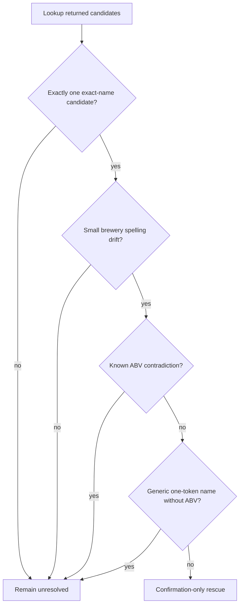
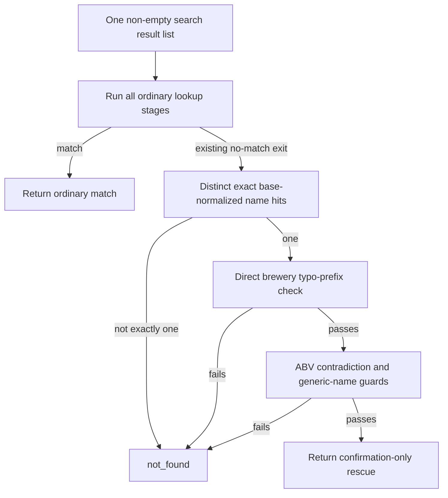

# Issue 407 Brewery Typo Rescue - Plan

## Goal Capsule

- **Objective:** Recover the largest safely provable subset of the live #407 orphan cohort without allowing a brewery typo to create an otherwise unsupported match.
- **Means:** Add a confirmation-only rescue for small brewery spelling errors after all ordinary lookup stages fail (KTD1-KTD4).
- **Product authority:** `spec.md` defines matching safety; `docs/orphan-triage-issues-runbook.md` defines replay, row ownership, and issue-closure behavior.
- **Execution profile:** Code change with test-first domain coverage, a normative spec update, and guarded orphan ownership operations.
- **Tail ownership:** The implementation pipeline owns the branch, review, PR, and CI. Deployment and issue closure remain post-merge operator steps.
- **Stop conditions:** Stop before code if live replay has no qualifying row. Stop before issue closure if an excluded row is assigned to an unverified destination issue.

---

## Product Contract

### Summary

Issue #407 gains a bounded rescue for an exact-name candidate rejected only by a small brewery spelling error.
The rescue maximizes coverage within explicit uniqueness, ABV, name-quality, and issue-ownership guards.

### Problem Frame

The current brewery gate accepts normalized leading-token identity but has no typo tolerance.
Issue #407 contains live cases where search already returned the intended beer and the name evidence is exact, yet one or two spelling errors in the shop brewery field discard it.

Per-typo curated aliases turn shop mistakes into permanent catalog policy.
A broad fuzzy brewery matcher is unsafe because brewery identity is a primary boundary against cross-brewery false positives.

### Key Decisions

- **Confirmation-only rescue.** (session-settled: user-directed — chosen over name-first matching and curated typo aliases: preserve brewery identity as a required signal while addressing repeated shop spelling drift.) Governs R1-R3, R7.
- **Unique exact-name candidate may pass without ABV.** (session-settled: user-directed — chosen over mandatory ABV: maximize the safely recoverable cohort when catalog identity is otherwise unique.) Governs R2, R4.
- **Known ABV contradiction blocks rescue.** (session-settled: user-directed — chosen over ignoring ABV: a wrong match is worse than a retained orphan.) Governs R4.
- **Generic one-token names need ABV.** (session-settled: user-directed — chosen over accepting every unique exact name: names such as `IPA` and `Pils` are weak identity evidence on their own.) Governs R5.
- **#407 remains the active focus.** (session-settled: user-approved — chosen over larger but heterogeneous orphan-triage cohorts: #407 has one replayable mechanism and a bounded safety envelope.) Governs R8-R10.

### Requirements

**Rescue eligibility**

- R1. The rescue may run only when the ordinary lookup returned candidates and the existing brewery gate rejected them; it must not run after a query-zero result.
- R2. Exactly one returned candidate must have the same normalized beer name as the orphan before brewery typo evidence can be considered.
- R3. The orphan and candidate brewery identities must differ only by a small spelling error consistent with the one- or two-character drift evidenced by #407; ownership, portfolio, transliteration, and unrelated alias gaps do not qualify.
- R4. Missing ABV does not block an otherwise eligible rescue, but known ABVs that fail the existing compatibility rule must block it.
- R5. A generic one-token beer name requires known compatible ABV in addition to the other eligibility rules; this restriction applies only to the new rescue path.

**Safety and separation**

- R6. Multiple exact-name candidates remain unresolved even if search rank or one candidate's ABV appears preferable.
- R7. Brewery typo similarity confirms evidence from R1-R5 and must never create a candidate, widen a query, or enable approximate beer-name matching.
- R8. Query-noise cases, product-name ambiguity, parent or portfolio brewery relationships, and semantic name translation remain owned by their existing issues.

**Cohort and issue ownership**

- R9. Every live row linked to #407 must be replayed against current Untappd behavior and assigned a recorded disposition before implementation scope is finalized.
- R10. A replayed row excluded by R1-R8 must be remapped by explicit `beer_id` only when an open issue is verified to own its actual mechanism; otherwise it remains on #407 and takes the documented retry. Every remap must leave `review_class` unchanged.
- R11. The #407 cohort must be captured before closure so the deployed fix can be evaluated after the keyed-lock retry.

### Decision Boundary

The flow illustrates R1-R7; the requirements remain authoritative.

### Key Flows

- F1. Cohort qualification
  - **Trigger:** #407 is selected for work.
  - **Steps:** Read the live linked cohort, replay each row, and classify it against R1-R8.
  - **Outcome:** Every row is either in the fix cohort or explicitly owned elsewhere.
  - **Covered by:** R8-R10.
- F2. Match evaluation
  - **Trigger:** Ordinary lookup returns candidates but the brewery gate rejects them.
  - **Steps:** Apply the exact-name uniqueness, brewery-drift, ABV, and generic-name guards in that order of evidence strength.
  - **Outcome:** A qualifying candidate is returned; every failed guard leaves the orphan unresolved.
  - **Covered by:** R1-R7.
- F3. Release and retry
  - **Trigger:** The verified fix is deployed and #407 is ready to close.
  - **Steps:** Capture the cohort, verify row ownership, close #407, and observe the keyed-lock retry outcome.
  - **Outcome:** Qualifying rows match; excluded rows do not unlock against the wrong issue.
  - **Covered by:** R10-R11.

### Acceptance Examples

- AE1. Exact multi-token name with compatible ABV
  - **Covers R1-R4, R7.**
  - **Given:** Search returns one exact-name candidate and its brewery differs by a small spelling error.
  - **When:** Both ABVs are known and compatible.
  - **Then:** The candidate is rescued.
- AE2. Exact multi-token name with missing ABV
  - **Covers R2-R4.**
  - **Given:** Search returns one exact-name candidate, brewery drift is a small spelling error, and one or both ABVs are missing.
  - **When:** No known ABV contradiction exists.
  - **Then:** The candidate is rescued.
- AE3. Known ABV contradiction
  - **Covers R4.**
  - **Given:** All other rescue conditions pass but both ABVs are known and incompatible.
  - **When:** The rescue is evaluated.
  - **Then:** The orphan remains unresolved.
- AE4. Generic one-token name without ABV
  - **Covers R5.**
  - **Given:** The only exact name is a generic one-token value such as `IPA` or `Pils` and compatible ABV is unavailable.
  - **When:** The rescue is evaluated.
  - **Then:** The orphan remains unresolved.
- AE5. Generic one-token name with compatible ABV
  - **Covers R5.**
  - **Given:** Search returns one generic one-token exact-name candidate and known ABVs are compatible.
  - **When:** The remaining rescue guards pass.
  - **Then:** The candidate may be rescued.
- AE6. Product ambiguity
  - **Covers R2, R6, R8.**
  - **Given:** Two returned candidates have the same normalized beer name.
  - **When:** Search order or ABV could favor one candidate.
  - **Then:** Neither candidate is rescued by #407.
- AE7. Query-zero or identity relationship
  - **Covers R1, R3, R8.**
  - **Given:** Search returned no candidates, or the brewery difference represents ownership, portfolio, transliteration, or a substantive alias gap.
  - **When:** The #407 rescue is considered.
  - **Then:** The rescue does not run and the row remains with the issue for its actual mechanism.

### Success Criteria

- Every live #407 row has fresh replay evidence and one disposition.
- At least one replay-qualified row is rescued; if none qualify, #407 is resolved through reclassification or closure without a matcher change.
- Every qualifying replay example matches its intended Untappd target.
- Ambiguous, query-zero, non-typo identity, and ABV-contradictory controls remain unresolved by this rescue.
- The recovered-row count is reported after the deployed fix receives its keyed-lock retry.

### Scope Boundaries

- No query widening or query-token cleanup.
- No approximate beer-name matching in the rescue path.
- No general fuzzy brewery matching.
- No parent, portfolio, transliteration, or semantic identity mapping.
- No fix for #334-style product ambiguity.
- No expansion of the curated brewery-alias table for shop-specific typos.
- Issue bookkeeping and explicit row remapping are in scope only to preserve keyed-lock ownership.

### Dependencies and Assumptions

- The live Untappd result set may have changed since earlier issue comments; current replay evidence overrides historical expected output.
- The production cohort count was nine at brainstorm time, but R9 governs the live cohort at execution time.
- Existing ABV compatibility behavior remains authoritative for R4 and R5.
- The production cohort contained nine rows at the 2026-08-20 replay. Appendix A records their current evidence and disposition.
- Existing ABV compatibility behavior remains authoritative, including the current treatment of numeric `0` as a known value.

### Sources and Research

- `spec.md` — brewery identity, name matching, ABV, and ambiguity invariants.
- `docs/orphan-triage-issues-runbook.md` — replay, issue ownership, cohort capture, and closure workflow.
- `docs/debug-orphan-matching.md` — query-zero versus candidate-rejection diagnosis.
- `docs/superpowers/specs/2026-08/2026-08-14-347-brewery-alias-batch-design.md` — replay disposition that split #407 from query-noise and ambiguity cases.
- `docs/superpowers/specs/2026-08/2026-08-15-421-fix-keyed-lock-design.md` — issue-keyed lock and retry consequences.
- `src/domain/matcher.ts` — current brewery identity and name-key behavior.
- `src/domain/untappd-lookup.ts` — strict and relaxed candidate stages, uniqueness, and ABV guards.
- `src/domain/brewery-aliases.ts` — finite curated alias policy.
- GitHub issue #407 — live examples, scope, and appended cohort evidence.

---

## Planning Contract

The Product Contract above is preserved. The decisions below choose implementation mechanisms without widening R1-R11.

### Key Technical Decisions

- KTD1. Route every existing `matchAgainst()` no-match exit through one typo-rescue fallback, including the empty-pool guard and ambiguous identity/native evidence exits. A rescue candidate must have failed strict, relaxed, native-alias, identity-alias, and brand evidence. Preserve every current successful-match short circuit and every current ordinary-stage stop boundary; the rescue runs only where that control flow would otherwise return `null`. Governs R1, R7.
- KTD2. Define exact beer-name evidence as equality of non-empty `baseNormalize()` values from the raw input and candidate names. Do not use `normalizeName`, `nameKeys`, aliases, brewery stripping, or fuzzy name scores. Count distinct `bid` values within the current non-empty search result list; exactly one may proceed. Governs R2, R6-R7.
- KTD3. Compare only direct `normalizeBrewery()` values, never curated aliases. Apply typo-aware leading-prefix alignment: compare the shorter token sequence with the start of the longer sequence, require exactly one changed aligned token of at least five characters, and require Levenshtein distance 1-2 for that token. Extra trailing official-name tokens remain allowed, matching the ordinary prefix gate. Reject token insertion/deletion inside the aligned prefix, a third edit, transliteration, and unrelated leading labels. Governs R3, R7-R8.
- KTD4. Keep the weak-name rule local to the rescue. A single `baseNormalize()` token is generic when it is one of `ipa`, `apa`, `neipa`, `dipa`, `tipa`, `pils`, `pilsner`, `lager`, `hell`, `helles`, `stout`, `porter`, `weizen`, `wheat`, `saison`, `sour`, `gose`, `lambic`, `barleywine`, or `bock`. Such a name requires both ABVs and compatibility within `ABV_TOLERANCE`; every other sole exact candidate may tolerate a missing ABV, but two known incompatible values always reject. Governs R4-R5.
- KTD5. Keep `/match`, `PreparedCatalog`, `breweryAliasesMatch`, query construction, and the curated brewery alias graph unchanged. The change belongs to the enrich lookup only, so its candidate-list boundary supplies the containment that the full-catalog matcher cannot. Governs R1, R7-R8.

### High-Level Technical Design

The ordinary lookup order and its current stop boundaries remain authoritative. Each path that would return `null` delegates to the same final rescue check. The rescue consumes only candidates from the current non-empty search attempt and cannot trigger another search.

### Implementation Constraints

- Keep the comparator dependency-free and local to `src/domain/untappd-lookup.ts`; do not alter the first-token catalog index.
- Deduplicate exact-name candidates by `bid` before applying the exactly-one rule.
- Treat candidate order as non-evidence. Reversing results must not change a rescue decision.
- Do not add #407 typo pairs to `src/domain/brewery-aliases.ts`.
- Use an isolated worktree based on the current `main` branch and include this plan plus the ideation artifact in the feature branch.

### Sequencing

1. Add focused failing lookup tests for KTD1-KTD5.
2. Implement the smallest lookup-local helper and rescue stage that makes those tests pass.
3. Update `spec.md` to document the exception without weakening the canonical brewery gate.
4. Run focused and full verification, then record replay and issue-ownership evidence before shipping the PR.

### System-Wide Impact

- Server enrichment can recover two current #407 rows. Browser-extension matching and its performance budget do not change.
- A wrong match persists in the beer catalog, so ambiguity and ABV rejection take precedence over recall.
- Closing #407 affects production row locks. The cohort snapshot and explicit ownership rules are part of correctness, not cleanup.

### Risks and Mitigations

- **Comparator breadth:** Whole-label fuzzy scoring could turn a portfolio relationship into a typo. KTD3 uses one bounded aligned token and direct labels only.
- **Name collapse:** `normalizeName()` can erase styles and make different products equal. KTD2 uses literal normalized evidence that retains style tokens.
- **Search-rank leakage:** Existing selection helpers may pick rank 1 or use ABV to break a multiple-candidate tie. KTD2 requires one distinct exact candidate before ABV is considered.
- **Operational misrouting:** An excluded row linked to the wrong issue unlocks at the wrong time. R10 and U3 require an explicit verified destination or no remap.

---

## Implementation Units

### U1. Add the confirmation-only lookup rescue

**Goal:** Implement the bounded #407 rescue without changing query behavior or ordinary match precedence.

**Requirements:** R1-R8; AE1-AE7.

**Dependencies:** None.

**Files:**

- `src/domain/untappd-lookup.ts`
- `src/domain/untappd-lookup.test.ts`

**Approach:**

1. Add test-first coverage that isolates the gate-miss path from existing strict and relaxed paths.
2. Add small private helpers for distinct exact-name selection, generic-name classification, and bounded aligned-token brewery comparison per KTD2-KTD4.
3. Replace each existing no-match return inside `matchAgainst()` with the same rescue fallback per KTD1; do not let this restructuring expose ordinary stages that the current control flow skips.
4. Return the sole candidate only after the ABV and generic-name guards pass.

**Patterns to follow:** Mirror `pickUniqueByAbv` for deduplication and contradiction handling, but do not inherit its multiple-candidate ABV selection. Mirror the native-alias tests for order-independent negative coverage.

**Test scenarios:**

- Covers AE1. `Jan Olbrach / Śmietanka` rescues `Jan Olbracht … / Śmietanka` with compatible ABV and a trailing official brewery descriptor.
- Covers AE2. A distinctive multi-token exact name with either input or candidate ABV missing rescues through a one-edit brewery typo.
- Covers AE3. Two present ABVs outside `ABV_TOLERANCE`, including the live `364` shape with candidate ABV `0`, remain `not_found`.
- Covers AE4. Generic one-token `IPA` or `Pils` without two compatible ABVs remains `not_found`.
- Covers AE5. Live-shaped `Kessman / Hell` rescues `Keesmann Bräu / Hell` at compatible ABV.
- Covers AE6. Two distinct exact-name `bid`s remain unresolved in both response orders, even when only one has compatible ABV.
- Duplicate rows with the same `bid` count as one candidate.
- One-edit and two-edit aligned tokens pass; a three-edit token, a changed short token, an inserted aligned token, transliteration, and an unrelated leading brewery token fail.
- An ordinary strict match wins before the rescue.
- Ambiguous identity/native evidence reaches the typo fallback without exposing later ordinary stages, and remains unresolved unless the independent typo contract passes.
- Covers AE7. Empty search results remain `not_found` and do not trigger a wider or extra query.

**Verification:** The focused lookup suite proves every positive and negative branch, and its search spies prove that no additional query occurs.

### U2. Document the bounded exception

**Goal:** Keep the normative matching specification aligned with the new enrich-only behavior.

**Requirements:** R1-R8.

**Dependencies:** U1.

**Files:**

- `spec.md`

**Approach:** Update the Untappd lookup stage description and brewery-gate invariant to cite a confirmation-only exception. State its candidate-list, exact-name uniqueness, bounded direct-label typo, and ABV limits. Preserve the no-general-fuzzy-gate and first-token index rules for `/match`.

**Test scenarios:** Test expectation: none — U1 owns executable behavior; this unit aligns the source-of-truth documentation.

**Verification:** A reviewer can reconcile the spec text with KTD1-KTD5 and find no claim that the canonical brewery gate or curated alias policy changed.

### U3. Preserve orphan ownership and release evidence

**Goal:** Make #407 safe to close after the code is deployed.

**Requirements:** R9-R11; F1, F3.

**Dependencies:** U1, U2.

**Files:** No committed production file. Evidence is recorded on GitHub issue #407 and in the operator's ignored `tmp/` cohort file.

**Approach:**

1. Post the Appendix A replay table to #407 with the replay timestamp and candidate evidence.
2. Remap only `beer_id=12269` from #407 to open issue #334, with a write predicate that also requires `issue_number=407`; change no other column.
3. Read the row back through `?mode=ro` and verify its destination and unchanged `review_class`.
4. Immediately before #407 closes, capture the still-linked IDs to `tmp/cohort-407.txt`; do not treat `unlocked_at` alone as recovery evidence.
5. After deploy, closure, and the retry window, report matched/deleted, retried-failed, and not-yet-attempted rows separately.

**Execution note:** Steps 4-5 are post-merge operator work. The shipping PR must state this residual handoff instead of claiming deployed recovery.

**Test scenarios:**

- The guarded update affects exactly `beer_id=12269` and preserves `review_class=matcher_bug`.
- Every other replayed row remains linked to #407 before closure.
- The pre-close cohort snapshot contains only rows still owned by #407 at capture time.

**Verification:** GitHub holds a reproducible disposition table, the production readback proves exact ownership, and the PR documents the post-merge cohort/retry check.

---

## Verification Contract

- Run the focused `src/domain/untappd-lookup.test.ts` suite first and confirm the new cases fail before implementation and pass afterward.
- Run TypeScript typechecking for application and scripts.
- Run the complete Vitest suite after focused coverage passes.
- Run `git diff --check` and inspect the final diff for changes outside U1-U3.
- Re-run the two qualifying live examples against current Algolia after implementation and confirm the intended `bid`s: `878279` for `30232` and `20175` for `31166`.
- Run code review with special attention to ambiguity, result-order dependence, ABV `0`, and any accidental use of curated aliases.
- Browser testing is not required because no browser or extension path changes. The pipeline browser-test stage may report a justified skip.

---

## Definition of Done

- U1: The focused tests prove the rescue and every boundary in KTD1-KTD5; the full test suite and typecheck pass.
- U2: `spec.md` describes the enrich-only rescue and preserves the canonical gate/index invariants.
- U3: The replay evidence is posted, `12269` is read back under #334 with unchanged `review_class`, and the PR contains the post-merge closure handoff.
- The final diff contains no query widening, alias additions, `/match` changes, extension changes, dependencies, or abandoned experiment code.
- The PR is open, review findings are resolved, and required CI checks are green or explicitly CI-decided.
- Completion of this implementation does not claim deployment, issue closure, or recovered-row counts; those require the post-merge U3 steps.

---

## Appendix

### Appendix A. Live #407 replay — 2026-08-20

The replay used the current production `enrich_failures` inputs and the repository's live Algolia adapter. All nine searches returned candidates and current `lookupBeer()` returned `not_found`.

| beer_id | Current evidence | Disposition |
|---:|---|---|
| 364 | Exact `Wileńskie Niefiltrowane`; `VILINIAUS`→`Vilniaus`; input 5.2 vs candidate 0.0 | Excluded by R4; remain on #407 because no verified alternate owner exists. |
| 386 | Exact `Raciborskie Klasyczne`; `Racbórz` does not align with leading `Zamkowy Racibórz` | Excluded by R3; remain on #407. |
| 12184 | `KVETINIS` vs `Kvietinis` is an additional beer-name typo | Excluded by R2; remain on #407. |
| 12269 | Two 5.7% Maryensztadt products remain plausible; neither is a sole literal exact name | Excluded by R2/R6; remap explicitly to open ambiguity issue #334. |
| 30201 | Ordinary brewery identity already matches; `Święty Jan Pils` is not literal-equal to candidate `Pils` | Excluded by R1/R2; remain on #407 without guessing an owner. |
| 30232 | Sole exact `Śmietanka`; `Olbrach`→`Olbracht`; 5.6% equals 5.6% | Qualifies; expected `bid=878279`. |
| 31166 | Sole exact generic `Hell`; `Kessman`→`Keesmann`; 4.8% equals 4.8% | Qualifies; expected `bid=20175`. |
| 34734 | `Kellebier` vs two `Kellerbier` candidates | Excluded by R2/R6; remain on #407. |
| 34816 | Exact `Kellerbier`; direct normalized brewery labels do not share the required typo-prefix shape | Excluded by R3; remain on #407. |

### Appendix B. Research Findings

- `src/domain/untappd-lookup.ts` already separates non-empty matcher rejection from query-zero retry. The new stage can stay inside one `matchAgainst()` invocation.
- `src/domain/matcher.ts` first-token indexing is a full-catalog performance invariant and must remain set-equivalent to `breweryAliasesMatch`.
- `docs/solutions/` contains no directly applicable matching learning. Its only transferable lesson is to prove the intended path rather than a fallback in regression tests.
- External research was skipped because no external dependency or standard governs this repository-local safety boundary.
