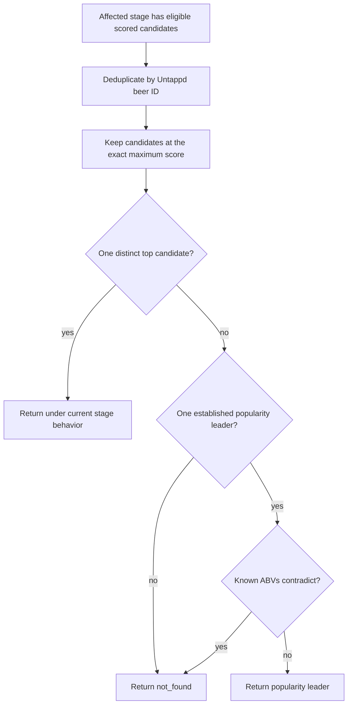

# Issue 409 Order-Independent Candidate Selection - Plan

## Goal Capsule

- **Objective:** Prevent scored approximate lookup stages from selecting different Untappd beers solely because equally scored candidates arrive in a different search-result order.
- **Means:** Route both affected stages through one scored-candidate resolver that reuses the existing popularity-dominance policy (KTD1-KTD3).
- **Product authority:** `spec.md` defines matching safety; GitHub issue #409 owns the order-dependent tie defect; the issue #487 flagship-dominance design defines the existing popularity and ABV contract reused here.
- **Execution profile:** Test-first domain behavior change, normative `spec.md` update, and no database operation, production-row remap, or extension change.
- **Tail ownership:** The implementation workflow owns code, tests, review, PR, and CI. Deployment and orphan-triage issue closure remain maintainer operations.
- **Stop conditions:** Stop before widening the change if a failing example originates outside the two selected scored stages or requires changing the established popularity thresholds.

---

## Product Contract

### Summary

Issue #409 makes tied candidate selection deterministic and fail-closed in the strict near-name and fuzzy lookup stages.
An unambiguous top score keeps current behavior; an exact top-score tie requires an established popularity leader that is not contradicted by ABV.

### Problem Frame

The strict near-name and fuzzy lookup stages rank candidates by a computed name score but currently fall back to the first result when the best score does not produce an ABV hit. When multiple distinct beers share the same highest score, that fallback turns the upstream result order into an undocumented identity discriminator. Reversing two otherwise identical results can therefore change which Untappd beer is selected.

Issue #334 exposed this symptom while investigating a broader, heterogeneous orphan cohort. That cohort also contains unrelated normalization collisions, malformed source fields, aliases, translations, and descriptor differences, so it cannot serve as one coherent matcher change. Issue #409 isolates the order-dependent tie mechanism addressed by this plan.

### Key Decisions

- **Issue #409 is the issue of record.** (session-settled: user-directed — chosen over rewriting #334 or opening another issue: #409 already isolates the verified result-order defect.) Governs R1 and R12.
- **Both scored approximate stages share the contract.** (session-settled: user-directed — chosen over changing only the first observed call site: strict near-name and fuzzy matching contain the same unsafe fallback.) Governs R1 and R9.
- **Only exact equality creates the top-score tie cohort.** (session-settled: user-directed — chosen over an epsilon or threshold-wide cohort: preserve the existing scoring boundaries and change only truly tied results.) Governs R3.
- **Repeated results for one Untappd beer count once.** (session-settled: user-directed — chosen over treating every search hit as a separate candidate: candidate ambiguity is about distinct beer identities.) Governs R2-R4.
- **Popularity resolves ties and ABV may only veto the leader.** (session-settled: user-directed — chosen over ABV-first selection: reuse the issue #487 identity contract and avoid promoting a less-supported runner-up.) Governs R5-R7.
- **Legacy results without rating counts fail closed in a tie.** (session-settled: user-directed — chosen over extra detail hydration: old extension relays should be rare because store updates are automatic, and missing evidence must not revive order dependence.) Governs R5 and R8.
- **A unique top-scoring beer keeps current behavior.** (session-settled: user-directed — chosen over adding a new ABV veto to all approximate matches: this fix is limited to ambiguity, not a broader ranking-policy change.) Governs R4.
- **Use one shared scored-candidate resolver.** (session-settled: user-directed — chosen over duplicated stage guards or a full lookup-pipeline refactor: keep both affected stages consistent without widening the architecture.) Governs R9-R10.

### Requirements

**Candidate cohort**

- R1. The new decision contract applies only to the strict near-name stage and the fuzzy-name stage in `lookupBeer`; every other lookup stage retains its current behavior.
- R2. Search results referring to the same non-empty Untappd beer ID (`bid`) must represent one candidate when deciding whether the highest score is unique or tied.
- R3. After each affected stage computes its existing scores and eligibility pool, the top cohort consists only of distinct candidates whose score is exactly equal to that stage's maximum score. Search-result position must not enter this decision.
- R4. If the top cohort contains one distinct candidate, the stage returns that candidate under its current rules, including the current behavior when known shop and candidate ABVs disagree.

**Tie resolution**

- R5. If the top cohort contains multiple distinct candidates, a candidate may be selected only when it satisfies the existing flagship-dominance rule: at least 1,000 ratings and at least five times the rating count of the strongest runner-up.
- R6. When one candidate satisfies R5, known shop and candidate ABVs must also satisfy the existing ABV compatibility rule; missing ABV does not itself veto the popularity leader.
- R7. If the popularity leader fails the ABV compatibility check, the stage must return `not_found`; it must not promote a runner-up or fall back to result order.
- R8. If rating counts are absent, insufficient, or fail to establish exactly one dominant candidate, the stage must return `not_found`.

**Consistency and regression safety**

- R9. Near-name and fuzzy matching must use the same scored-candidate decision behavior rather than maintaining independent tie policies.
- R10. The shared behavior must preserve each stage's existing candidate eligibility, scoring formula, score threshold, brewery restrictions, and placement in the lookup sequence.
- R11. Automated tests must prove that reversing equally scored candidates cannot change the outcome, that the unique-top path retains current behavior, and that dominance, missing popularity evidence, and ABV vetoes follow R4-R8 in both affected stages.
- R12. This change must not alter issue #334 row ownership, close or remap orphan-triage rows, or claim to solve the unrelated mechanisms found in that cohort.

### Decision Boundary

The flow illustrates R2-R8; the requirements remain authoritative.

### Acceptance Examples

- AE1. Unique top score with contradictory ABV
  - **Covers R3-R4.**
  - **Given:** One distinct candidate has the exact highest score and its known ABV conflicts with the shop ABV.
  - **When:** Either affected stage resolves its scored candidates.
  - **Then:** The candidate is returned under the stage's current unique-top behavior.
- AE2. Dominant candidate in an exact tie
  - **Covers R3, R5-R6.**
  - **Given:** Two distinct candidates share the exact highest score, one has at least 1,000 ratings and at least five times the other's rating count, and its ABV is compatible or unavailable.
  - **When:** The tie is resolved.
  - **Then:** The dominant candidate is returned.
- AE3. Dominant candidate contradicted by ABV
  - **Covers R5-R7.**
  - **Given:** The exact top-score cohort has a popularity leader, but its known ABV conflicts with the shop ABV.
  - **When:** The tie is resolved.
  - **Then:** The stage returns `not_found` and does not select the runner-up.
- AE4. No dominance evidence
  - **Covers R5 and R8.**
  - **Given:** Distinct top-scoring candidates lack rating counts, remain below the minimum, or have no five-times leader.
  - **When:** The tie is resolved.
  - **Then:** The stage returns `not_found`.
- AE5. Search order reversed
  - **Covers R3, R7-R9, R11.**
  - **Given:** The same exact top-score candidates are supplied in opposite orders.
  - **When:** Each order is evaluated with the same popularity and ABV evidence.
  - **Then:** Both evaluations return the same beer or both return `not_found`.
- AE6. Duplicate hits for one beer
  - **Covers R2-R4.**
  - **Given:** The result set repeats one `bid` at the highest score and contains no other distinct candidate at that score.
  - **When:** The top cohort is formed.
  - **Then:** The repeated hits count as one candidate and follow the unique-top path.

### How This Work Fits Together

<!-- ce-section: work-relationships -->

The original #334 investigation separated four mechanisms that should not be implemented as one matcher change:

1. **Issue #409 — selected here:** order-independent resolution of exact top-score ties in `lookupBeer` near-name and fuzzy stages.
2. **Lossy `/match` normalization collisions — deferred:** cases where style-word removal collapses materially different product names require a separate contract for the local catalog matcher.
3. **Malformed or swapped source identity fields — deferred:** blank breweries, brand-as-brewery values, and brewery/name inversions require source-quality or input-repair work rather than candidate tie-breaking.
4. **Issue #334 cohort ownership — deferred:** any split, supersession, row remap, retry, or closure requires a separate row-by-row operational decision that leaves `review_class` unchanged.

These units share discovery context but have different safety boundaries and release consequences. Completing #409 must not be used as evidence that the full #334 cohort is fixed.

### Success Criteria

- Reversing distinct exact top-score candidates produces the same result in both affected stages.
- Every ambiguous top cohort either selects the established popularity leader permitted by R5-R6 or returns `not_found`.
- Unique-top results remain behaviorally unchanged, including their existing ABV treatment.
- Existing popularity thresholds and ABV compatibility semantics are reused without modification.
- Tests cover the tie contract for near-name and fuzzy matching and preserve all existing lookup-stage tests.

### Scope Boundaries

- No change to exact-key, relaxed-brewery, brand, Czech-grade, native-alias, terminal flagship, or local `/match` behavior.
- No new scoring formula, similarity threshold, epsilon, rating threshold, or popularity data source.
- No rating-count hydration for legacy HTML relay results.
- No candidate selection based on search-result order or ABV-first runner-up promotion.
- No repair for brewery aliases, translated names, descriptor divergence, blank fields, swapped fields, or brand-as-brewery inputs.
- No production database write, orphan row remap, issue closure, extension release, or user-visible extension change.
- No broad lookup-pipeline refactor.

### Dependencies and Assumptions

- The current `rating-dominance` contract remains authoritative: 1,000 minimum ratings, five-times dominance, and ABV as a veto rather than a selector.
- Modern server and extension Algolia results provide `rating_count`; the legacy HTML relay may not, and R8 intentionally handles that absence by failing closed.
- `bid` is the stable Untappd beer identity available in candidate results and is suitable for distinct-candidate counting.
- The affected stages continue to produce deterministic numeric scores for a given candidate payload; only exact numeric equality forms a tie.
- Chrome Web Store automatic updates make legacy extension relays a diminishing compatibility path, but no minimum installed version is assumed.

### Sources and Research

- `spec.md` — lookup architecture and matching safety invariants.
- `src/domain/untappd-lookup.ts` — current near-name and fuzzy score handling, first-result fallback, and existing lookup sequence.
- `src/domain/rating-dominance.ts` — established popularity thresholds and ABV-veto behavior.
- `src/sources/untappd/search.ts` — candidate result contract and legacy HTML relay behavior.
- `src/sources/untappd/algolia.ts` and `src/api/routes/enrich.ts` — modern rating-count propagation.
- `src/domain/untappd-lookup.test.ts` — existing order-sensitive regression fixture and lookup-stage coverage.
- `docs/superpowers/specs/2026-08/2026-08-25-487-flagship-dominance-design.md` — prior product decision for popularity-led identity and ABV veto.
- `docs/superpowers/specs/2026-08/2026-08-15-421-fix-keyed-lock-design.md` — orphan issue ownership and retry consequences relevant to excluded operations.
- GitHub issues #334 and #409 — discovery cohort and isolated defect ownership.

---

## Planning Contract

**Product Contract preservation:** Product Contract unchanged. R1-R12 and AE1-AE6 retain their requirements-only meanings.

### Key Technical Decisions

- KTD1. **Keep the resolver private to `untappd-lookup.ts`.** Add one module-local scored-candidate resolver and adapt both affected stages to its input shape. (session-settled: user-directed — chosen over duplicated stage guards or a full lookup-pipeline refactor: one local seam keeps the two policies identical without widening the architecture.) Implements R1, R9-R10.
- KTD2. **Retain the strongest score per `bid` before forming the top cohort.** This makes repeated appearances through multiple target names one identity while preserving the best evidence computed by the existing stage. Implements R2-R4.
- KTD3. **Require complete popularity evidence only inside ambiguous top cohorts.** Before calling `dominantCandidate`, the resolver rejects a multi-candidate cohort when any member lacks `rating_count`; `rating-dominance.ts` and its other consumers stay unchanged. Implements R5-R8.
- KTD4. **Treat an unresolved top cohort as a terminal decision for that result set.** Each affected stage returns `not_found` when the resolver returns no candidate instead of falling through to a lower-confidence stage. Implements R7-R8 and preserves the current stage precedence in R10.
- KTD5. **Prove the behavior through the public `lookupBeer` seam.** Stage-specific fixtures exercise near-name and fuzzy integration without exporting the resolver or adding test-only production hooks. Implements R11.

### Implementation Surface

- `src/domain/untappd-lookup.ts` — add the shared resolver and replace the two order-sensitive fallback blocks.
- `src/domain/untappd-lookup.test.ts` — replace the result-order-pinning regression and add symmetric coverage for both affected stages.
- `spec.md` — make the #409 tie contract normative in the enrichment matching description and remove the obsolete statement that ABV selects every fuzzy tie.

### Implementation Constraints

- Keep `dominantCandidate`, `DOMINANCE_RATIO`, `FLAGSHIP_MIN_RATINGS`, and `ABV_TOLERANCE` unchanged; they remain the authorities adopted by R5-R6.
- Preserve the existing exact-key and native-alias policies even where their tie behavior differs from R1-R8.
- Do not add a dependency or export a new public domain API.
- Do not add an extension changelog entry because no browser-extension code or extension release behavior changes.

---

## Implementation Units

### U1. Resolve scored approximate ties without result-order fallback

**Goal:** Make strict near-name and fuzzy top-score ties deterministic while preserving every non-tie and non-target stage behavior.

**Requirements:** R1-R11 and AE1-AE6. R12 remains an exclusion enforced by the file boundary and verification review.

**Dependencies:** None. The existing `dominantCandidate` and ABV compatibility contract are already present.

**Files:**

- Modify: `src/domain/untappd-lookup.ts`
- Test: `src/domain/untappd-lookup.test.ts`
- Modify: `spec.md`

**Approach:**

1. Add the module-local resolver beside the existing candidate-picking helpers and give both scored stages the same result-and-score representation (KTD1).
2. Collapse repeated `bid` values to their strongest scored occurrence, derive the exact maximum-score cohort, and keep the unique-top return path independent of popularity and ABV (KTD2; R2-R4).
3. For a multi-candidate cohort, reject incomplete rating evidence before delegating to `dominantCandidate`; return its compatible leader or no candidate without changing the shared dominance helper (KTD3; R5-R8).
4. Replace the near-name and fuzzy ABV-first fallback blocks with the resolver and terminate the current lookup result set when an ambiguous cohort remains unresolved (KTD4).
5. Update the two relevant `spec.md` passages so the normative text distinguishes unique-top behavior, exact-score ambiguity, popularity selection, and ABV veto without changing the separate #487 native-alias rule.

**Execution note:** Start with failing `lookupBeer` regression tests for both stage families, then implement the smallest shared resolver that makes them pass.

**Patterns to follow:**

- `pickUniqueByAbv` in `src/domain/untappd-lookup.ts` for module-local candidate selection and `bid` deduplication style.
- `dominantCandidate` in `src/domain/rating-dominance.ts` for popularity ranking, threshold ownership, and no-runner-up promotion after an ABV veto.
- The `#487 popularity-led matching` and `#505 filtered identity` describe blocks in `src/domain/untappd-lookup.test.ts` for issue-scoped behavioral fixtures.

**Test scenarios:**

- Covers AE4 / AE5. Rework the existing `Tomatol / Bulgogi` near-name regression so two equally scored distinct candidates without `rating_count` return `not_found` in both input orders.
- Covers AE2 / AE5. Give the same near-name tie complete rating counts with one five-times leader and compatible ABV; both input orders return that leader.
- Covers AE3. Give the near-name leader a contradictory ABV and the runner-up a compatible ABV; the result is `not_found`, never the runner-up.
- Covers AE1. Supply one distinct near-name top candidate with a contradictory ABV; the current matched outcome remains unchanged.
- Covers AE6. Repeat one near-name top candidate with the same `bid`; it counts once and follows the unique-top path.
- Covers AE4 / AE5. Use strict-brewery input `Extraordinary Magnificent Alpha` against distinct `Extraordinary Magnificent Beta` candidates: the full strings tie above the fuzzy threshold while the differing tokens stay below near-name coverage; missing rating counts return `not_found` in both orders.
- Covers AE2 / AE5. Give that fuzzy tie complete rating counts with one five-times leader and compatible ABV; both input orders return the leader.
- Covers AE3. Give the fuzzy popularity leader a contradictory ABV and its runner-up a compatible ABV; the result is `not_found`, never the runner-up.
- Covers AE1. Leave one distinct fuzzy top candidate with a contradictory ABV; the current matched outcome remains unchanged.
- Covers AE6. Repeat one fuzzy top candidate with the same `bid`; it counts once and follows the unique-top path.
- Keep the existing exact-key vintage test passing to prove Stage 2a still uses ABV as its selector and remains outside R1.

**Verification:**

- Every new stage-specific regression passes through `lookupBeer` without exporting internal helpers.
- Reversing ambiguous candidates never changes the selected `bid` or `not_found` outcome.
- The existing lookup suite shows no behavior change outside the two affected stage blocks.
- `spec.md` describes the same decision boundary as R1-R8 and no longer states that ABV selects all equally scored fuzzy candidates.

---

## Verification Contract

| Gate | Command | Proves |
|---|---|---|
| Focused behavior | `npm test -- src/domain/untappd-lookup.test.ts` | U1 covers both approximate stages, order reversal, deduplication, dominance, missing popularity, ABV veto, and unique-top preservation. |
| Domain regression | `npm test -- src/domain/rating-dominance.test.ts src/domain/untappd-lookup.test.ts` | U1 reuses the existing #487 thresholds and veto semantics without changing their contract. |
| Static correctness | `npm run typecheck` | The shared resolver integrates with both scored-match shapes without weakening TypeScript checks. |
| Full regression | `npm test` | Unrelated lookup stages and the rest of the application remain green. |
| Diff hygiene | `git diff --check` | The implementation introduces no whitespace errors. |

No browser test, production replay, database command, or extension package build is required. The change is pure `lookupBeer` domain behavior with no persistent-data or browser-extension code path.

---

## Definition of Done

- U1 satisfies R1-R11 and all six acceptance examples through focused automated coverage.
- The exact same ambiguous candidate set produces the same outcome in either search order for both affected stages.
- Unique-top scored matches and every excluded lookup stage retain their documented behavior.
- `spec.md`, the implementation, and the tests agree on the #409 decision boundary.
- Focused tests, typecheck, the full test suite, and diff hygiene all pass.
- The diff contains no database operation, orphan ownership change, extension changelog entry, new dependency, unrelated refactor, test-only production hook, or abandoned experimental code.
